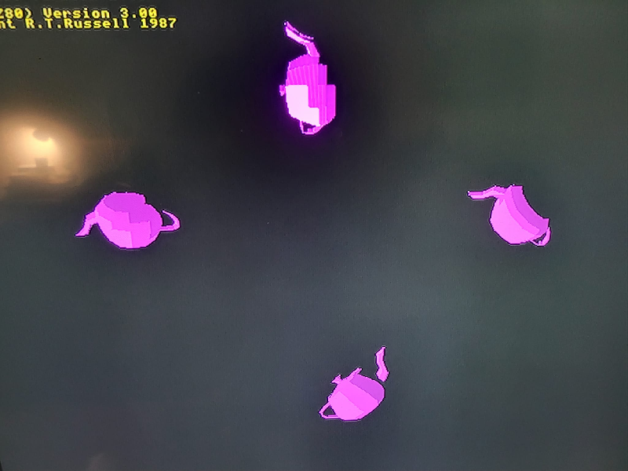

## Introduction to 3D Render Commands

A 3D scene is composed of one or more object models (meshes), each of which uses
some texture for colorizing the model. A texture uses a bitmap for its
pixel colors, and the model uses texture coordinates to assign colors to its
surfaces when the render is performed.

There are various mathematical computations involved in 3D rendering, of course,
and floating point numbers are used for many of those computations. However, VDU
commands do not directly support passing floating point numbers, as the VDU statement
only supports passing 1-byte and 2-byte values. For that reason, many of the
values passed to the render commands are scaled values.

The commands below use numbers with the following meaning and ranges:

 id: A specific primitive ID in the range 0 to 65535, where 0 is the root primitve.
 pid: A parent primitive ID in the range 0 to 65535, where 0 is the root primitve.
 mid: A specific mesh ID in the range 0 to 65535. This is not a primitive ID.
 tid: A specific texture ID in the range 0 to 65535. This is not a primitive ID.
 oid: A specific object ID in the range 0 to 65535. This is not a primitive ID.
 flags: Refer to the Primitive Flags section of this document.
 n: A positive number (count) of things that follow within the same command.
 x: A 2D X coordinate in the range -32768 to +32767. Often, the value is in or near the range of 0 to 800.
 y: A 2D Y coordinate in the range -32768 to +32767. Often, the value is in or near the range of 0 to 600.
 w: A positive width that typically ranges from 1 to 800.
 h: A positive height that typically ranges from 1 to 600.
 x0, y0, z0: A prescaled 3D X, Y, or Z coordinate in the range -32767 to +32767.
This number is divided by 32767 to yield a floating point number in the range -1.0 to +1.0, for 3D computations.
 i0: A zero-based index into a list of coordinates (mesh or texture).
 u0, v0: A texture coordinate ranging from 0 to the width or height of the texture.
This value is divided by the texture width to yield a floating point number, for 3D computations.
 scalex, scaley, scalez: A prescaled 3D X, Y, or Z scale value in the range 0 to 65535.
This number is divided by 256 to yield a floating point number in the approximate range 0.0 to 256.0, for 3D computations.
 anglex, angley, anglez: A prescaled 3D X, Y, or Z rotation angle value in the range -32767 to +32767.
This number is divided by 32767 to yield a floating point number in the range -1.0 to +1.0, for 3D computations.
The resulting number if multiplied by 2*PI, to yield an angle in radians.
Thus, the passed value of -32767 means -2*PI, and +32767 means +2*PI.
 distx, disty, distz: A prescaled 3D X, Y, or Z translation distance in the range -32767 to +32767.
This number is divided by 32767 to yield a floating point number in the range -1.0 to +1.0, for 3D computations.
The resulting number if multiplied by 256.0.
Thus, the passed value of -32767 means -256.0, and +32767 means +256.0.

## Create primitive: Render 3D Scene
<b>VDU 23, 30, 200, id; pid; flags; x; y; w; h;</b> :  Create primitive: Render 3D Scene

This command creates a primitive that renders a 3D scene to a bitmap. The bitmap can be
manipulated or altered using the bitmap related commands, after the scene image
has been rendered. A scene may contain multiple objects. This primitive must be
created prior to using other 3D related commands, below.

## Create Mesh
<b>VDU 23, 30, 201, id; mid; n; x0; y0; z0; ...</b> :  Create Mesh

This command establishes the list of mesh coordinates to be used to define an object.
The mesh may be referenced in multiple objects.

## Set Mesh Vertex Indices
<b>VDU 23, 30, 202, id; mid; n; i0; ...</b> :  Set Mesh Vertex Indices

This command lists the indexes of the vertices that define a 3D mesh. Individual
vertices are often referenced multiple times within a mesh, because they are
often part of multiple surface triangles. The number of indices passed in this
command must match the number of mesh indices defining the mesh.

## Create Texture
<b>VDU 23, 30, 203, id; tid; n; u0; v0; ...</b> :  Create Texture

This command establishes the list of U/V texture coordinates that define texturing
for a mesh. The texture may be used by multiple objects, such as a fleet of similar objects.

## Set Texture Coordinate Indices
<b>VDU 23, 30, 204, id; mid; tid; n; i0; ...</b> :  Set Texture Coordinate Indices

This command lists the indexes of the coordinates that define a 3D texture.
Individual coordinates may be referenced multiple times within a texture,
but that is not required. The number of indices passed in this command must match
the number of mesh indices defining the mesh. Thus, each mesh vertex has a texture
coordinates associated with it.

## Create Object
<b>VDU 23, 30, 205, id; oid; mid; tid; bmid;</b> :  Create Object

## Set Object X Scale Factor
<b>VDU 23, 30, 206, id; oid; scalex;</b> :  Set Object X Scale Factor

## Set Object Y Scale Factor
<b>VDU 23, 30, 207, id; oid; scaley;</b> :  Set Object Y Scale Factor

## Set Object Z Scale Factor
<b>VDU 23, 30, 208, id; oid; scalez;</b> :  Set Object Z Scale Factor

## Set Object XYZ Scale Factors
<b>VDU 23, 30, 209, id; oid; scalex; scaley; scalez</b> :  Set Object XYZ Scale Factors

## Set Object X Rotation Angle
<b>VDU 23, 30, 210, id; oid; anglex;</b> :  Set Object X Rotation Angle

## Set Object Y Rotation Angle
<b>VDU 23, 30, 211, id; oid; angley;</b> :  Set Object Y Rotation Angle

## Set Object Z Rotation Angle
<b>VDU 23, 30, 212, id; oid; anglez;</b> :  Set Object Z Rotation Angle

## Set Object XYZ Rotation Angles
<b>VDU 23, 30, 213, id; oid; anglex; angley; anglez;</b> :  Set Object XYZ Rotation Angles

## Set Object X Translation Distance
<b>VDU 23, 30, 214, id; oid; distx;</b> :  Set Object X Translation Distance

## Set Object Y Translation Distance
<b>VDU 23, 30, 215, id; oid; disty;</b> :  Set Object Y Translation Distance

## Set Object Z Translation Distance
<b>VDU 23, 30, 216, id; oid; distz;</b> :  Set Object Z Translation Distance

## Set Object XYZ Translation Distances
<b>VDU 23, 30, 217, id; oid; distx; disty; distz</b> :  Set Object XYZ Translation Distances

## Render To Bitmap
<b>VDU 23, 30, 218, id;</b> :  Render To Bitmap

The following image illustrates the concept, but the actual appearance will differ on the Agon, because this image was created on a PC.

[Bitmap](otf_bitmap.md)
[Home](otf_mode.md)
